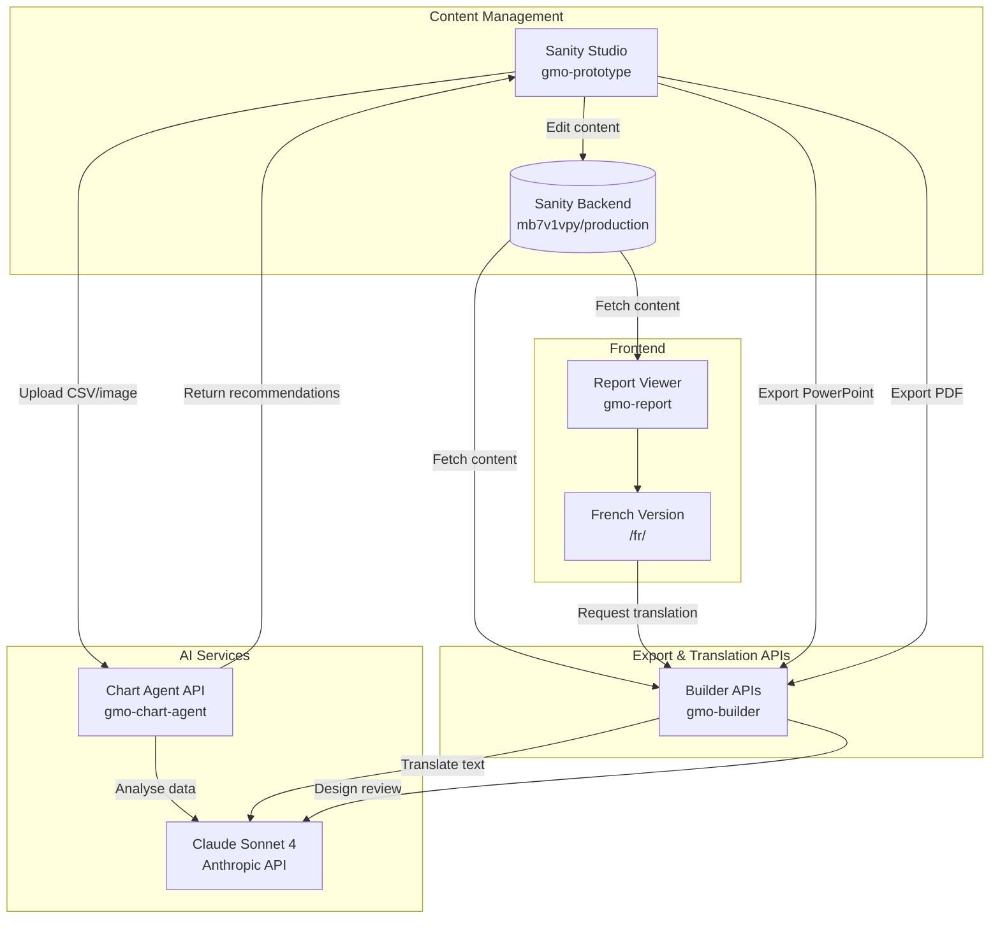

# Developer Handover Guide

## GMO Digital Transformation Project

**Last Updated:** January 28, 2026
**Version:** 1.0
**Client:** AXA Investment Managers / BNP Paribas Asset Management
**Consultancy:** Pattrn Studios

---

## Table of Contents

1. [Project Overview](#1-project-overview)
2. [Architecture Overview](#2-architecture-overview)
3. [Tech Stack](#3-tech-stack)
4. [Project Structure](#4-project-structure)
5. [Local Development Setup](#5-local-development-setup)
6. [API Documentation](#6-api-documentation)
7. [Deployment](#7-deployment)
8. [Key Code Patterns](#8-key-code-patterns)
9. [Known Issues & Technical Debt](#9-known-issues--technical-debt)
10. [Troubleshooting](#10-troubleshooting)

---

## 1. Project Overview

### What the Project Does

The GMO (Global Market Outlook) Digital Transformation project converts traditional static PowerPoint financial reports into an interactive, web-based digital experience. The system provides a modern content management workflow where editors can create rich financial reports with AI-assisted chart building, automatic French translation, and export capabilities back to PowerPoint and PDF formats.

The platform consists of a headless CMS (Sanity) for content authoring, an interactive React-based report viewer with dark/light themes and bilingual support, and several AI-powered microservices that provide intelligent chart recommendations, content suggestions, design review, and translation services.

### The Problem It Solves

Financial institutions traditionally produce monthly market outlook reports as PowerPoint decks, which are:
- Time-consuming to update and maintain
- Difficult to share digitally in an accessible format
- Not optimised for web viewing or mobile devices
- Labour-intensive to translate into multiple languages
- Prone to inconsistent design and formatting

This platform automates much of the manual work, ensures design consistency, and provides a modern web experience for report consumers.

### Target Users

1. **Content Editors** - Create and manage reports via Sanity Studio
2. **Financial Analysts** - View and consume reports via the web viewer
3. **Marketing Teams** - Export reports for distribution
4. **Developers** - Maintain and extend the platform

---

## 2. Architecture Overview

### System Architecture Diagram



### Data Flow

1. **Content Creation**: Editors log into Sanity Studio and create/edit report sections
2. **Chart Building**: When adding charts, editors upload CSV/Excel files or chart images; the Chart Agent API sends data to Claude for analysis and returns chart recommendations
3. **Content Publishing**: Edited content is saved to Sanity's production dataset
4. **Report Viewing**: The React viewer fetches the latest published content from Sanity on each page load (no build required)
5. **Translation**: French page requests translation from the Builder API, which uses Claude to translate and returns structured JSON
6. **Export**: PowerPoint and PDF exports are generated server-side by the Builder API

### Key Design Decisions

| Decision | Rationale |
|----------|-----------|
| **4-service architecture** | Separation of concerns; each service can scale/deploy independently |
| **Client-side Sanity fetching** | Content updates appear immediately without rebuild |
| **Static Next.js export** | Simple deployment, good performance, SEO-friendly |
| **Claude Sonnet 4 for AI** | Best balance of quality and cost for financial content |
| **Recharts for charts** | React-native, highly customisable, good TypeScript support |
| **Vercel for all services** | Unified platform, easy CI/CD, good serverless support |

---

## 3. Tech Stack

### Frontend (gmo-report)

| Technology | Version | Purpose |
|------------|---------|---------|
| Next.js | ^14.2.0 | React framework with static export |
| React | ^18.3.0 | UI component library |
| TypeScript | ^5.0.0 | Type safety |
| Tailwind CSS | ^3.4.0 | Utility-first styling |
| Recharts | ^2.15.0 | Chart rendering (15+ chart types) |
| Framer Motion | ^11.0.0 | Animations and transitions |
| @sanity/client | ^6.0.0 | Sanity CMS integration |

### CMS (gmo-prototype)

| Technology | Version | Purpose |
|------------|---------|---------|
| Sanity | ^4.22.0 | Headless CMS framework |
| React | ^19.2.3 | UI components |
| TypeScript | ^5.8 | Type safety |
| Recharts | ^2.15.0 | Chart preview in Studio |
| styled-components | ^6.1.18 | CSS-in-JS for custom components |
| xlsx | ^0.18.5 | Excel file parsing |
| papaparse | ^5.5.3 | CSV parsing |
| react-dropzone | ^14.3.8 | File upload UI |

### Chart Analysis API (gmo-chart-agent)

| Technology | Version | Purpose |
|------------|---------|---------|
| Express.js | ^4.18.2 | HTTP server |
| cors | ^2.8.5 | CORS middleware |
| multer | ^1.4.5-lts.1 | File upload handling |
| xlsx | ^0.18.5 | Excel parsing |
| dotenv | ^16.3.1 | Environment variable loading |

### Export & Translation APIs (gmo-builder)

| Technology | Version | Purpose |
|------------|---------|---------|
| @anthropic-ai/sdk | ^0.71.2 | Claude API client |
| @sanity/client | ^6.0.0 | Sanity data fetching |
| pptxgenjs | ^4.0.1 | PowerPoint generation |
| pdfkit | ^0.15.0 | PDF generation |
| canvas | ^3.2.1 | Server-side image rendering |
| adm-zip | ^0.5.16 | ZIP file handling |
| xml2js | ^0.6.2 | XML parsing |

### External Services

| Service | Purpose |
|---------|---------|
| Anthropic Claude API | AI for chart analysis, translation, design review |
| Sanity.io | Headless CMS backend and CDN |
| Vercel | Hosting and serverless functions |
| QuickChart.io | Chart rendering to PNG for PowerPoint |

---

## 4. Project Structure

```
gmo/
├── DEPLOYMENT_SUMMARY.md          # Deployment documentation
├── DEVELOPER_HANDOVER.md          # This file
├── EXECUTIVE_SUMMARY.md           # Stakeholder summary
├── RECOMMENDED_NEXT_STEPS.md      # Production roadmap
├── README.md                      # Project README
│
├── documentation/                 # Brand assets and specs
│   ├── BNP_Paribas_Design_Specification.md
│   ├── GMO Colours.pdf
│   ├── GMO Typestack.pdf
│   └── GMO Digital Enhancements_Project Brief.pdf
│
├── gmo-report/                    # REACT REPORT VIEWER
│   ├── package.json
│   ├── next.config.js             # Static export, Sanity CDN
│   ├── tsconfig.json
│   ├── tailwind.config.js         # Theme colours, fonts
│   ├── postcss.config.js
│   ├── src/
│   │   ├── app/
│   │   │   ├── layout.tsx         # Root layout with ThemeProvider
│   │   │   ├── page.tsx           # English report (/)
│   │   │   └── fr/
│   │   │       └── page.tsx       # French report (/fr/)
│   │   ├── components/
│   │   │   ├── charts/
│   │   │   │   ├── RechartsRenderer.tsx   # Universal chart renderer
│   │   │   │   └── types.ts               # Chart type definitions
│   │   │   ├── layout/
│   │   │   │   ├── ReportLayout.tsx       # Main layout wrapper
│   │   │   │   ├── LanguageDropdown.tsx   # EN/FR selector
│   │   │   │   ├── TableOfContents.tsx    # Sidebar navigation
│   │   │   │   ├── ThemeProvider.tsx      # Dark/light mode context
│   │   │   │   ├── ThemeToggle.tsx        # Theme switch button
│   │   │   │   ├── PageTransition.tsx     # Framer Motion wrapper
│   │   │   │   └── Footer.tsx             # Report footer
│   │   │   └── sections/
│   │   │       ├── SectionRenderer.tsx    # Section type router
│   │   │       ├── TitleSection.tsx       # Cover slide
│   │   │       ├── ContentSection.tsx     # Text + chart sections
│   │   │       ├── ChartInsightsSection.tsx  # Chart with insights panel
│   │   │       ├── NavigationSection.tsx  # Table of contents
│   │   │       ├── HeaderSection.tsx      # Section dividers
│   │   │       └── TimelineSection.tsx    # Timeline display
│   │   ├── lib/
│   │   │   ├── sanity.ts          # Sanity client + GROQ queries
│   │   │   └── utils.ts           # CSV parsing, utilities
│   │   └── styles/
│   │       └── globals.css        # CSS variables, Tailwind imports
│   └── out/                       # Built static output
│
├── gmo-prototype/                 # SANITY CMS STUDIO
│   ├── package.json
│   ├── sanity.config.ts           # Studio config, document actions
│   ├── sanity.cli.ts              # CLI config (project ID, dataset)
│   ├── tsconfig.json
│   ├── CHART_BUILDER_USER_GUIDE.md
│   ├── schemaTypes/               # Content schemas
│   │   ├── index.ts               # Schema exports
│   │   ├── report.ts              # Main report document
│   │   ├── titleSection.ts        # Cover slide schema
│   │   ├── navigationSection.ts   # TOC schema
│   │   ├── contentSection.ts      # Chart section schema
│   │   ├── chartInsightsSection.ts # Chart + insights schema
│   │   ├── headerSection.ts       # Divider slide schema
│   │   ├── timelineSection.ts     # Timeline schema
│   │   ├── routingSection.ts      # Navigation routing
│   │   └── slide.ts               # Legacy slide schema
│   └── components/
│       ├── ChartBuilder/          # AI chart building UI
│       │   ├── index.tsx
│       │   ├── ChartBuilderInput.tsx      # Sanity input wrapper
│       │   ├── ChartBuilderModal.tsx      # Main modal UI
│       │   ├── FileUploadArea.tsx         # CSV/Excel upload
│       │   ├── ImageUploadArea.tsx        # Chart image upload
│       │   ├── EditableDataTable.tsx      # Data editing grid
│       │   ├── ChartPreview.tsx           # Live preview
│       │   ├── RechartsRenderer.tsx       # Chart render
│       │   ├── AlternativesThumbnails.tsx # Alt chart options
│       │   ├── types.ts
│       │   ├── utils.ts
│       │   └── styles.ts
│       ├── ContentSuggestions/    # AI content generation
│       │   ├── index.ts
│       │   ├── ContentSuggestModal.tsx
│       │   ├── ContentSectionInput.tsx
│       │   ├── SuggestionCard.tsx
│       │   ├── types.ts
│       │   └── utils.ts
│       ├── PowerPointReview/      # AI export review
│       │   ├── index.ts
│       │   ├── PowerPointReviewModal.tsx
│       │   ├── SlidePreviewGallery.tsx
│       │   ├── SuggestionsList.tsx
│       │   └── types.ts
│       └── ViewFrenchTranslationAction.tsx  # Translation action
│
├── gmo-chart-agent/               # AI CHART ANALYSIS API
│   ├── package.json
│   ├── index.js                   # Express server + routes
│   ├── vercel.json                # Vercel deployment config
│   ├── .env.example               # Environment template
│   └── lib/
│       └── design-tokens.cjs      # Brand colours for charts
│
└── gmo-builder/                   # EXPORT & TRANSLATION API
    ├── package.json
    ├── vercel.json                # Vercel routes config
    ├── build-slide.mjs            # Legacy build script
    ├── api/                       # Serverless functions
    │   ├── translate-json.js      # French translation endpoint
    │   ├── translate.js           # Legacy translation
    │   ├── build.js               # HTML builder (legacy)
    │   ├── pdf-export.js          # PDF generation
    │   ├── pptx-export.js         # PowerPoint generation
    │   ├── pptx-preview.js        # Slide preview images
    │   └── pptx-review.js         # AI design review
    ├── lib/
    │   ├── translation-client.js  # Claude translation logic
    │   ├── chart-config.js        # Chart.js config builder
    │   ├── html-generator.js      # Legacy HTML generation
    │   ├── ai-review/
    │   │   ├── index.js           # Claude review integration
    │   │   └── prompts.js         # Review prompts
    │   ├── design-tokens/
    │   │   ├── index.js
    │   │   ├── colors.js
    │   │   ├── typography.js
    │   │   ├── css.js
    │   │   └── bnpp-tokens.json   # BNP Paribas brand tokens
    │   ├── pdf/
    │   │   ├── pdf-generator.js
    │   │   ├── chart-renderer.js
    │   │   ├── layout-optimizer.js
    │   │   └── fonts/             # TTF font files
    │   ├── powerpoint/
    │   │   └── color-utils.js
    │   └── slide-preview/
    │       └── canvas-renderer.js
    └── powerpoint/
        ├── export-to-powerpoint.js
        ├── chart-converter.js
        ├── chart-image-renderer.js
        ├── template-config.json
        ├── template-layouts-raw.json
        ├── template-theme.json
        └── generators/            # Slide type generators
            ├── title-slide.js
            ├── toc-slide.js
            ├── divider-slide.js
            ├── chart-slide.js
            ├── insights-slide.js
            └── timeline-slide.js
```

---

## 5. Local Development Setup

### Prerequisites

- **Node.js**: v18.x or later (v20.x recommended)
- **npm**: v9.x or later
- **Git**: For version control
- **Anthropic API Key**: Required for AI features
- **Sanity account**: Access to project `mb7v1vpy`

### Environment Variables

Create `.env` files in the following locations:

**gmo-chart-agent/.env**
```bash
# Anthropic API key for chart analysis
CLAUDE_API_KEY=sk-ant-api03-xxxxx

# Server port (optional, defaults to 3000)
PORT=3000
```

**gmo-builder** (set via Vercel dashboard for production):
```bash
# Anthropic API key for translation and design review
ANTHROPIC_API_KEY=sk-ant-api03-xxxxx
```

### Setup Instructions

#### 1. Clone the Repository

```bash
git clone https://github.com/Pattrn-Studios/gmo.git
cd gmo
```

#### 2. Install Dependencies (all projects)

```bash
# Report Viewer
cd gmo-report && npm install && cd ..

# Sanity Studio
cd gmo-prototype && npm install && cd ..

# Chart Agent API
cd gmo-chart-agent && npm install && cd ..

# Builder APIs
cd gmo-builder && npm install && cd ..
```

#### 3. Start Development Servers

Run each in a separate terminal:

```bash
# Terminal 1: Report Viewer (port 3000)
cd gmo-report && npm run dev

# Terminal 2: Sanity Studio (port 3333)
cd gmo-prototype && npm run dev

# Terminal 3: Chart Agent API (port 3001 or configured)
cd gmo-chart-agent && npm run dev
```

**Note**: `gmo-builder` APIs are designed for Vercel serverless and are typically tested via deployment or `vercel dev`.

### Available Scripts

| Project | Command | Description |
|---------|---------|-------------|
| gmo-report | `npm run dev` | Start Next.js dev server |
| gmo-report | `npm run build` | Build static export |
| gmo-report | `npm run lint` | Run ESLint |
| gmo-prototype | `npm run dev` | Start Sanity Studio |
| gmo-prototype | `npm run deploy` | Deploy to Sanity hosting |
| gmo-chart-agent | `npm run dev` | Start Express server |
| gmo-builder | `npm run dev` | Build and open HTML output |

---

## 6. API Documentation

### Chart Agent API (gmo-chart-agent)

**Base URL**: `https://gmo-chart-agent.vercel.app`

#### POST /api/analyse

Analyse CSV/Excel data and recommend optimal chart type.

**Request**:
```json
{
  "csvData": "Year,Revenue,Profit\n2020,100,20\n2021,120,25\n2022,150,35"
}
```

**Response**:
```json
{
  "chartType": "line",
  "title": "Revenue and Profit Trends",
  "series": [
    { "label": "Revenue", "dataColumn": "Revenue", "colour": "#00005E" },
    { "label": "Profit", "dataColumn": "Profit", "colour": "#00A3A3" }
  ],
  "xAxisLabel": "Year",
  "yAxisLabel": "Value",
  "yAxisFormat": "number",
  "reasoning": "Line chart best shows trend over time...",
  "alternatives": [
    { "chartType": "area", "title": "...", "series": [...] },
    { "chartType": "column", "title": "...", "series": [...] }
  ]
}
```

#### POST /api/analyse-image

Extract data from chart image and recommend recreation.

**Request**: `multipart/form-data` with `image` field

**Response**: Same structure as `/api/analyse` with additional `csvData` field containing extracted data.

#### POST /api/content-suggest

Generate content suggestions based on chart data.

**Request**:
```json
{
  "chartData": "...",
  "chartType": "line",
  "context": "Market outlook section"
}
```

**Response**:
```json
{
  "title": "Suggested Section Title",
  "subtitle": "Supporting subtitle text",
  "bullets": [
    "Key insight point one",
    "Key insight point two",
    "Key insight point three"
  ],
  "insights": [
    "Insight for insights panel"
  ]
}
```

#### POST /api/refine

Refine chart recommendation based on user feedback.

**Request**:
```json
{
  "csvData": "...",
  "currentConfig": { ... },
  "feedback": "Make it a bar chart instead"
}
```

### Builder APIs (gmo-builder)

**Base URL**: `https://gmo-builder.vercel.app`

#### GET /api/translate-json

Fetch French translation of latest report.

**Response**: Complete report JSON with all text content translated to French.

**Headers**:
- `Cache-Control: public, max-age=300` (5-minute cache)

#### POST /api/pptx-export

Generate PowerPoint file from report.

**Request**:
```json
{
  "reportId": "report-document-id"
}
```

**Response**: Binary `.pptx` file download

#### POST /api/pptx-preview

Generate slide preview images.

**Request**:
```json
{
  "reportId": "report-document-id",
  "mode": "one_per_type"
}
```

**Response**:
```json
{
  "previews": [
    { "slideIndex": 0, "image": "data:image/png;base64,..." },
    { "slideIndex": 1, "image": "data:image/png;base64,..." }
  ]
}
```

#### POST /api/pptx-review

AI review of slide designs.

**Request**:
```json
{
  "previews": [
    { "slideIndex": 0, "image": "data:image/png;base64,..." }
  ]
}
```

**Response**:
```json
{
  "suggestions": [
    {
      "slideIndex": 0,
      "category": "textLength",
      "severity": "HIGH",
      "issue": "Title exceeds 80 characters",
      "recommendation": "Shorten to: 'Market Overview Q1'"
    }
  ]
}
```

#### POST /api/pdf-export

Generate a branded PDF document from a Sanity report. Renders all 6 section types (title, navigation, header, content, chart insights, timeline) with full image and chart support, aligned with the PowerPoint export pipeline.

**Request**:
```json
{
  "reportId": "report-document-id",
  "options": {}
}
```

**Processing pipeline**:
1. Fetches report from Sanity using a comprehensive GROQ query (all section types, images, chart configs, color themes)
2. Pre-fetches all referenced images from Sanity CDN as base64 (company logo, section images, header images, timeline item images, navigation card images)
3. Renders charts to PNG via QuickChart.io for `contentSection` and `chartInsightsSection`
4. Delegates PDF assembly to `lib/pdf/pdf-generator.js` (PDFKit) with design tokens, themed section backgrounds, section number badges, and branded page footers

**Response**: Binary `.pdf` file download with `Content-Disposition: attachment` header

### Sanity API

**Project ID**: `mb7v1vpy`
**Dataset**: `production`
**API Version**: `2024-01-01`

Content is fetched using GROQ queries. See `gmo-report/src/lib/sanity.ts` for query examples.

### Authentication

| API | Auth Method |
|-----|-------------|
| Chart Agent | Bearer token (CLAUDE_API_KEY in .env) |
| Builder APIs | Bearer token (ANTHROPIC_API_KEY in Vercel) |
| Sanity Read | Public (no auth required) |
| Sanity Write | Token-based (Studio only) |

### Rate Limits & Costs

| Service | Limit | Cost Implication |
|---------|-------|------------------|
| Claude API | ~1000 requests/min | ~$0.003-0.015 per 1K tokens |
| Sanity API | 100 requests/sec | Included in plan |
| Vercel Functions | 1000/day (hobby) | Upgrade for more |

---

## 7. Deployment

### Production URLs

| Service | URL | Platform |
|---------|-----|----------|
| Report Viewer | https://gmo-report.vercel.app | Vercel |
| French Report | https://gmo-report.vercel.app/fr/ | Vercel |
| Sanity Studio | https://gmo-prototype.sanity.studio | Sanity |
| Builder APIs | https://gmo-builder.vercel.app | Vercel |
| Chart Agent | https://gmo-chart-agent.vercel.app | Vercel |

### Deployment Process

#### Automatic (Vercel)

All services auto-deploy on push to `main` branch:

```bash
git push origin main
# Triggers deployment for gmo-report, gmo-builder, gmo-chart-agent
```

#### Manual (Sanity Studio)

```bash
cd gmo-prototype
npx sanity deploy
```

### Vercel Configuration

**gmo-report** - Uses Next.js static export:
```javascript
// next.config.js
{
  output: 'export',
  trailingSlash: true,
  images: { unoptimized: true }
}
```

**gmo-builder/vercel.json**:
```json
{
  "rewrites": [
    { "source": "/api/:path*", "destination": "/api/:path*" }
  ]
}
```

**gmo-chart-agent/vercel.json**:
```json
{
  "rewrites": [
    { "source": "/(.*)", "destination": "/index.js" }
  ]
}
```

### Environment Variables for Production

Set these in Vercel dashboard:

| Project | Variable | Required |
|---------|----------|----------|
| gmo-builder | ANTHROPIC_API_KEY | Yes |
| gmo-chart-agent | CLAUDE_API_KEY | Yes |
| gmo-prototype | SANITY_STUDIO_CHART_AGENT_URL | Optional (override) |

### CI/CD

Currently using Vercel's built-in CI/CD:
- Push to `main` triggers production deployment
- Pull requests create preview deployments
- No custom GitHub Actions configured

---

## 8. Key Code Patterns

### Sanity Client Configuration

```typescript
// gmo-report/src/lib/sanity.ts
import { createClient } from '@sanity/client'

export const sanityClient = createClient({
  projectId: 'mb7v1vpy',
  dataset: 'production',
  useCdn: false,  // Fresh data on every request
  apiVersion: '2024-01-01'
})

export async function getLatestReport() {
  return sanityClient.fetch(`
    *[_type == "report"] | order(publicationDate desc)[0] {
      _id,
      title,
      sections[] {
        _type,
        // ... projection fields
      }
    }
  `)
}
```

### Chart Rendering Pattern

```typescript
// gmo-report/src/components/charts/RechartsRenderer.tsx
export function RechartsRenderer({ config }: { config: ChartConfig }) {
  const { chartType, chartData, chartSeries } = config
  const data = parseCSV(chartData)

  switch (chartType) {
    case 'line':
      return <LineChart data={data}>...</LineChart>
    case 'bar':
      return <BarChart data={data}>...</BarChart>
    // ... 15+ chart types
  }
}
```

### Section Renderer Pattern

```typescript
// gmo-report/src/components/sections/SectionRenderer.tsx
export function SectionRenderer({ section }: { section: Section }) {
  switch (section._type) {
    case 'titleSection':
      return <TitleSection {...section} />
    case 'contentSection':
      return <ContentSection {...section} />
    case 'chartInsightsSection':
      return <ChartInsightsSection {...section} />
    // ... other section types
  }
}
```

### Claude API Integration

```javascript
// gmo-builder/lib/translation-client.js
import Anthropic from '@anthropic-ai/sdk'

const anthropic = new Anthropic()

export async function translateReport(report) {
  const translatable = extractTranslatableFields(report)

  const response = await anthropic.messages.create({
    model: 'claude-sonnet-4-20250514',
    max_tokens: 4096,
    messages: [{
      role: 'user',
      content: `Translate to French: ${JSON.stringify(translatable)}`
    }]
  })

  return mergeTranslations(report, response.content[0].text)
}
```

### Theme System

```css
/* gmo-report/src/styles/globals.css */
:root {
  --color-bg-primary: #ffffff;
  --color-text-primary: #1a1a1a;
  --color-brand: #00005E;
}

[data-theme="dark"] {
  --color-bg-primary: #1a1a1a;
  --color-text-primary: #ffffff;
}
```

### Error Handling Pattern

```javascript
// gmo-builder/api/translate-json.js
export default async function handler(req, res) {
  try {
    const report = await fetchLatestReport()
    const translated = await translateReport(report)

    res.setHeader('Cache-Control', 'public, max-age=300')
    res.json(translated)
  } catch (error) {
    console.error('Translation error:', error)
    res.status(500).json({
      error: 'Translation failed',
      message: error.message
    })
  }
}
```

---

## 9. Known Issues & Technical Debt

### Current Limitations

| Issue | Severity | Description |
|-------|----------|-------------|
| No authentication | Medium | Report viewer is public (intentional for prototype) |
| No rate limiting | Medium | APIs vulnerable to abuse |
| Translation cache | Low | Only 5-minute cache; could be longer |
| Hard-coded project ID | Low | Sanity project ID in code, not env var |
| No monitoring | Medium | No alerting for API failures |
| ESM/CJS mix | Low | gmo-builder uses workarounds for module compatibility |

### Technical Debt

1. **Legacy code in gmo-builder**: `build.js`, `translate.js` are unused but still present
2. **Duplicate RechartsRenderer**: Exists in both gmo-report and gmo-prototype
3. **No TypeScript in gmo-builder/gmo-chart-agent**: JavaScript only, missing type safety
4. **Test coverage**: No automated tests in any project
5. **Error boundaries**: Missing in React components

### Workarounds in Place

1. **PptxGenJS loading**: Uses `createRequire()` to handle ESM/CJS mismatch on Vercel
2. **Image optimization**: Disabled in Next.js for static export
3. **Chart image rendering**: Uses QuickChart.io as canvas doesn't work in browser

---

## 10. Troubleshooting

### Common Issues

#### "Failed to fetch report" in viewer

**Cause**: Sanity API unreachable or CORS issue
**Solution**: Check Sanity project status at sanity.io/manage

#### "Translation API returns 500"

**Cause**: Missing ANTHROPIC_API_KEY or Claude API error
**Solution**: Verify env var in Vercel dashboard; check Claude API status

#### Chart not rendering in Studio

**Cause**: Chart Agent API unreachable
**Solution**: Ensure gmo-chart-agent is deployed and CORS allows Sanity Studio origin

#### French page shows English content

**Cause**: Translation API returning cached/stale data
**Solution**: Wait 5 minutes for cache to expire or redeploy gmo-builder

#### PowerPoint export fails

**Cause**: Chart rendering issue or Sanity image fetch failure
**Solution**: Check browser console for specific error; ensure all images are published

### Debug Tips

1. **Sanity queries**: Use Vision plugin in Sanity Studio to test GROQ queries
2. **API responses**: Use browser Network tab or Postman to inspect API calls
3. **Chart issues**: Log `chartData` and `chartSeries` to console in RechartsRenderer
4. **Vercel logs**: Check Vercel dashboard for serverless function logs

### Useful Commands

```bash
# Check Sanity dataset content
cd gmo-prototype && npx sanity documents query "*[_type == 'report']"

# Test translation API locally
curl https://gmo-builder.vercel.app/api/translate-json | jq .

# Check deployed function logs
vercel logs gmo-builder --follow

# Rebuild and deploy Sanity Studio
cd gmo-prototype && npx sanity build && npx sanity deploy

# Clear Next.js cache
cd gmo-report && rm -rf .next out && npm run build
```

### Getting Help

- **Sanity documentation**: https://www.sanity.io/docs
- **Recharts documentation**: https://recharts.org/
- **Anthropic documentation**: https://docs.anthropic.com/
- **Vercel documentation**: https://vercel.com/docs

---

## Appendix: Sanity Schema Types

| Type | Purpose | Key Fields |
|------|---------|------------|
| `report` | Main document | title, slug, publicationDate, sections[] |
| `titleSection` | Cover slide | heading, subheading, backgroundImage |
| `navigationSection` | Table of contents | title, cardImages[] |
| `contentSection` | Chart section | title, subtitle, chartConfig, layout |
| `chartInsightsSection` | Chart + insights | chartConfig, insights[], insightsPosition |
| `headerSection` | Section divider | title, subtitle, backgroundColor |
| `timelineSection` | Timeline | items[{number, header, body}] |

---

**Document maintained by**: Pattrn Studios
**Last reviewed**: January 28, 2026
